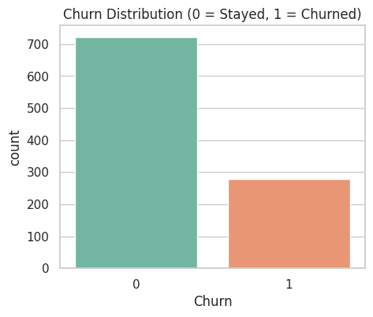
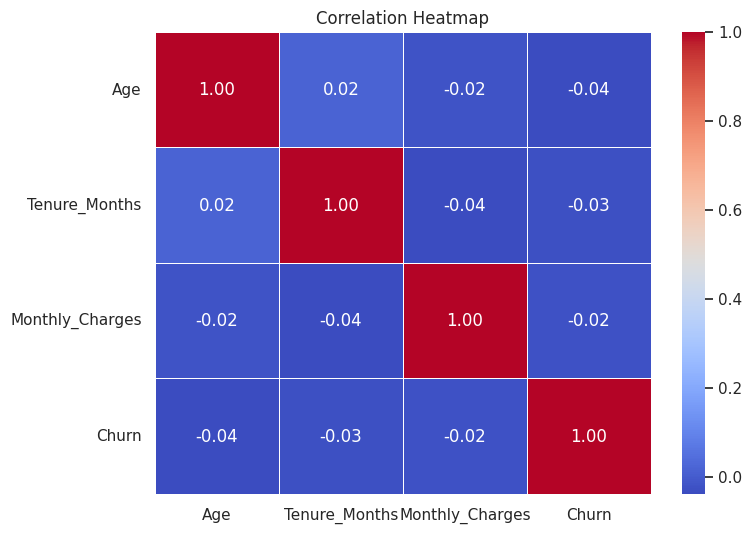
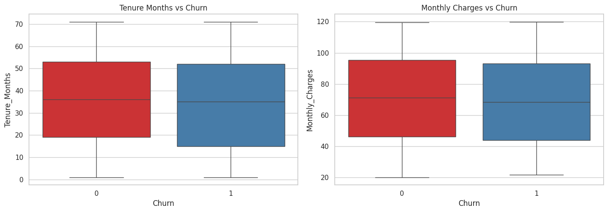
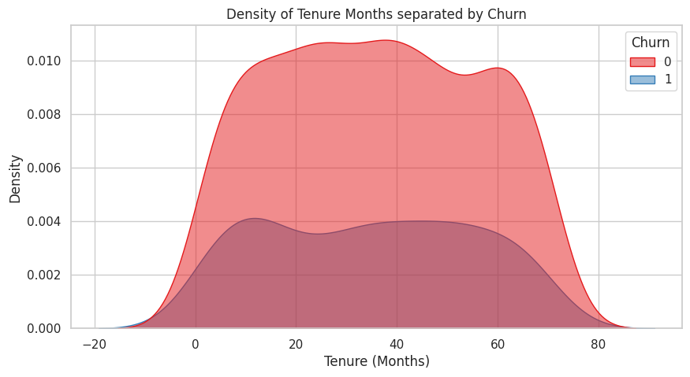
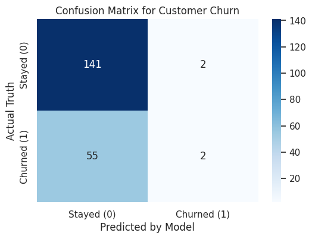

# 📉 Customer Churn Prediction


## 📌 Overview

This is an end-to-end Machine Learning classification project designed to predict customer churn.

The main goal of this project is to build a clean and reusable ML workflow using `Scikit-Learn Pipelines` to reduce data leakage, optimize a `RandomForestClassifier` using `GridSearchCV`, and deploy the final model through an interactive `Streamlit` web application.

---

## 🎯 Problem Statement

Customer churn is a major challenge for subscription-based businesses. Losing customers directly affects revenue and growth.

This project aims to predict whether a customer is likely to churn based on customer behavior, service usage, and account-related features.

---

## 💼 Business Value

This model can help businesses:

- Identify customers with a high risk of churn
- Take proactive retention actions
- Improve customer lifetime value
- Reduce revenue loss caused by customer cancellation

---

## 📌 Project Workflow

1. Data Cleaning
2. Exploratory Data Analysis
3. Feature Engineering
4. Preprocessing using `Scikit-Learn Pipeline`
5. Model Training
6. Hyperparameter Tuning using `GridSearchCV`
7. Model Evaluation
8. Deployment using `Streamlit`

---

## 📊 Data Insights

Visualizing the data is a crucial step to uncover patterns before model training.

### 1. Target Variable Distribution

The dataset shows class imbalance, which is common in real-world churn prediction problems.



### 2. Feature Correlations

Correlation analysis was used to understand the relationships between numerical features and customer churn.



### 3. Behavioral Analysis

Continuous variables such as tenure and monthly charges were analyzed to understand their impact on churn behavior.





---

## 🧠 Model

The final model is an optimized **Random Forest Classifier**.

The model was trained inside a `Scikit-Learn Pipeline`, which keeps preprocessing and model training in one workflow and helps reduce data leakage.

Hyperparameter tuning was performed using `GridSearchCV`.

---

## 📈 Model Performance

| Metric | Score |
|---|---:|
| Accuracy | 71.50% |
| Precision | 50.00% |
| Recall | 3.51% |
| F1-score | 6.56% |
| Specificity | 98.60% |
| Balanced Accuracy | 51.05% |

> Although the model achieves 71.50% accuracy, the recall score is low, meaning the model struggles to correctly detect churned customers. This is mainly due to class imbalance, where most customers belong to the non-churn class.

### Confusion Matrix


---

## 🛠️ Tech Stack

- **Machine Learning:** Scikit-Learn, RandomForestClassifier, Pipeline, GridSearchCV
- **Data Processing:** Pandas, NumPy
- **Data Visualization:** Seaborn, Matplotlib
- **Web App:** Streamlit
- **Model Saving:** Joblib

---

## 🚀 How to Run Locally

Clone the repository:

```bash
git clone https://github.com/Ziad3Alaa3/Customer-Churn-Prediction.git
cd Customer-Churn-Prediction

Install dependencies:

pip install -r requirements.txt

Run the Streamlit app:

streamlit run app.py
📁 Repository Structure
Customer-Churn-Prediction/
│
├── app.py
├── churn_prediction_pipeline.ipynb
├── churn_prediction_pipeline.pkl
├── churn_distribution.png
├── correlation_heatmap.png
├── features_boxplots.png
├── tenure_density.png
├── confusion_matrix.png
└── README.md
👨‍💻 Developer

Ziad Alaa
Machine Learning Engineer

GitHub: Ziad3Alaa3
LinkedIn: (www.linkedin.com/in/ziadalaa-dev)

